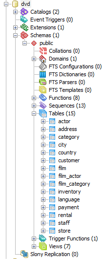

Лабораторные работы по курсу "Базы данных", часть 1
================================

# Расписание
Занятия в этом семестре будут в каждой из двух групп проходить один раз в две недели, начиная с 13 февраля:

Группа 1 |Группа 2 | Тема
---- | ---- | ----
13.02.2017 | 20.02.2017 | Вводное занятие. Установка PG, импорт данных, простейшие запросы. 
27.02.2017 | 06.03.2017 | Операторы DDL и DML. Разработка своей схемы, наполнение данными. 
13.03.2017 | 20.03.2017 | Выборки данных. Операторы, функции. 
27.03.2017 | 03.04.2017 | Выборки с группировками, подзапросы. Расширения стандарта SQL. 
10.04.2017 | 17.04.2017 | Функции работы со структурированными данными (JSON, XML). 
24.04.2017 | 01.05.2017 | Индексы, планы запросов, просмотр статистики. Оптимизация запросов. Представления. 
08.05.2017 | 15.05.2017 | Триггеры. Хранимые процедуры и функции. 
22.05.2017 | 29.05.2017 | Защита выполненных работ. 


# Начало работы
Для выполнения работ необходимо [скачать](https://www.postgresql.org/download/) и установить сервер СУБД PostgreSQL. Для Windows рекомендуется дистрибутив [EnterpriseDB](https://www.enterprisedb.com/downloads/postgres-postgresql-downloads).

Работы этого семестра будут использовать в качестве примера БД с сайта http://postgresqltutorial.com/, которая была, в свою очередь, портирована из проекта Sakila для MySQL (http://dev.mysql.com/doc/sakila/en/). После установки сервера нужно скачать и импортировать образ базы данных:
[dvdrental.zip](files/dvdrental.zip) или http://www.postgresqltutorial.com/postgresql-sample-database/

В zip-архив упакована резервная копия базы данных в формате tar. Инструкция по восстановлению БД с помощью утилит командной строки - в документации, [25.1 backup-dump](https://www.postgresql.org/docs/10/static/backup-dump.html#BACKUP-DUMP-RESTORE).

В получившейся базе данных должно быть 15 таблиц, 7 представлений и 8 функций:



Расположение файлов на диске можно узнать с помощью функции `pg_relation_filepath`, пример выборки есть в документации Postgres в параграфе [Determining Disk Usage](https://www.postgresql.org/docs/10/static/disk-usage.html):

```sql
SELECT pg_relation_filepath(c.oid), n.nspname, c.relname, c.relpages, c.relkind 
FROM pg_class c JOIN pg_namespace n ON c.relnamespace = n.oid 
WHERE n.nspname = 'public'
```

> :grey_question: Вопрос: что обозначают символы в столбце relkind? Почему у некоторых записей в столбце path нет значения?


# Схема базы данных


# Что читать
В первую очередь стоит просмотреть обучающий раздел на сайте Postgresql.org ( [Tutorial](http://www.postgresql.org/docs/10/static/tutorial.html) ) и первые уроки на [postresqltutorial.com](http://www.postgresqltutorial.com). Также можно скачать электронные книги с диска F: или из чата.

Рекомендованный online-курс: [Погружение в СУБД (2017)](https://stepik.org/course/3203/syllabus) на Stepik.

